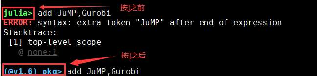
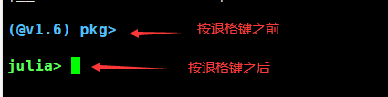
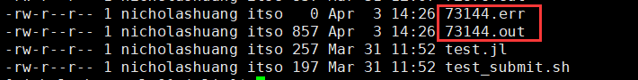
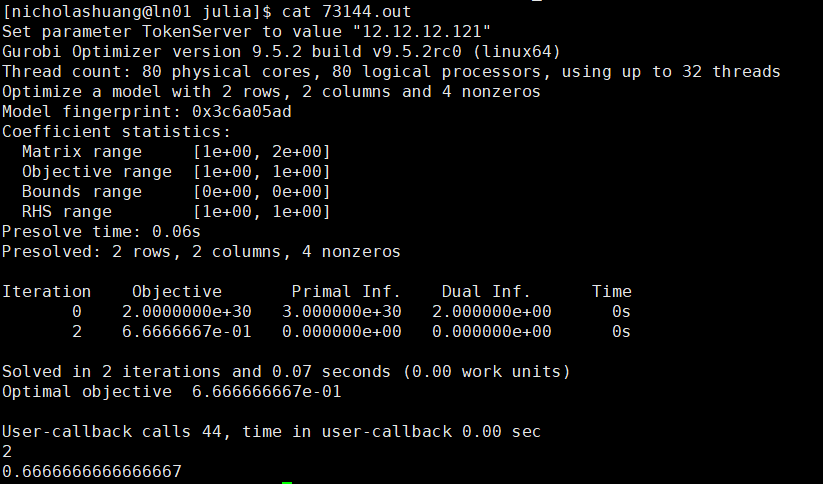

**本例中以 CUHKSZ 用户账号 nicholashuang 为例，请用户根据具体情况替换为自己的个人账号**
## 1、 SSH 登陆 CE 集群的登陆节点 10.27.130.12。

## 2、登陆后创建存放执行脚本的文件目录。
创建文件目录（本例文件目录为 gurobi_julia，各用户根据各自的情况创建自己的文件目录）  
`$ mkdir -p /home/nicholashuang/gurobi_julia`  
`$ cd /home/nicholashuang/gurobi_julia`  

## 3、将执行文件传输到该目录下。  
要在 CE 集群上使用 gurobi+julia 进行运算，需要有两个文件。  
1) 自己编写的 jl 文件，本例中的 jl 文件以 test.jl 为例，内容如下，请用户根据实际情况更改 jl 文件的命名和内容。  
```python
a = 1+1;
println(a);

using JuMP,Gurobi;
mp = Model(Gurobi.Optimizer);
@variable(mp, x1 >= 0);
@variable(mp, x2 >= 0);
@constraint(mp, 2x1 + x2 <= 1);
@constraint(mp, 2x2 + x1 <= 1);
@objective(mp, Max, x1+x2);
optimize!(mp);

println(objective_value(mp));
```
2) 提交任务的脚本，本例中提交任务的脚本以 test_submit.sh 为例，具体文件内容如下，用户根据实际情况更改该文件的命名和内容。  
```python
#!/bin/sh
#SBATCH -J test
#SBATCH -o %j.out
#SBATCH -e %j.err
#SBATCH --nodes=1
#SBATCH --ntasks=5 
##SBATCH --exclusive

module load gurobi/952 metis/4.0 openblas/0.3.15 julia/1.6.2

julia test.jl
```
请将这两个文件传输到上文新创建的目录中，即/home/nicholashuang/gurobi_julia 中。  

## 4、加载环境  
加载 julia 和 gurobi 所需的环境  
`$ module load gurobi/952 metis/4.0 openblas/0.3.15 coinhsl/2021.05.05.openblas julia/1.6.2 lapack/3.10.0`  
加载 gurobi 所需的环境，加载完成后，可用 module list 命令检查环境是否已经正常加载。  
`$ module list`  
4、加载环境
加载 julia 和 gurobi 所需的环境
$ module load gurobi/952 metis/4.0 openblas/0.3.15 coinhsl/2021.05.05.openblas julia/1.6.2 lapack/3.10.0
加载 gurobi 所需的环境，加载完成后，可用 module list 命令检查环境是否已经正常加载。
$ module list
  
## 5、安装JuMP和Gurobi  
`$ julia`  
进入到julia中，然后按键盘上的“ ] ”键，进入julia的pkg模式，进入该模式后，命令行提示符会更换成(@v1.6 pkg)> ，如下图所示  
  
在pkg模式下安装JuMp和Gurobi  
`(@v1.6) pkg> add JuMP, Gurobi`  
包安装完成后，按下退格键（即BACKSPACE键），退出到普通julia模式，按退格键后，提示符会从之前的(@v1.6 pkg)>变回来。效果如下图所示：  
  
接着退出julia回到shell。  
`julia> exit()`  

## 6、提交任务  
用sbatch提交任务  
`$ sbatch test_submit.sh`  
在任务的执行过程中，可使用下列命令查看任务状态  
`$ squeue`  
`$ sacct`  
`$ scontrol show job xxxx` （xxxx为该job的id）  

## 7、输出结果  
按照本例程序里的设定，任务执行完毕后，会生成如图所示的两个文件  
  
确认任务是否有报错  
`$ cat xxx.err`  
确认任务输出结果  
`$ cat xxx.out`  
若本例正常结束，xxx.err为空，xxx.out的输出结果如下图所示：  
  
