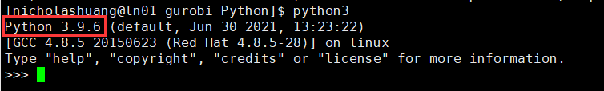
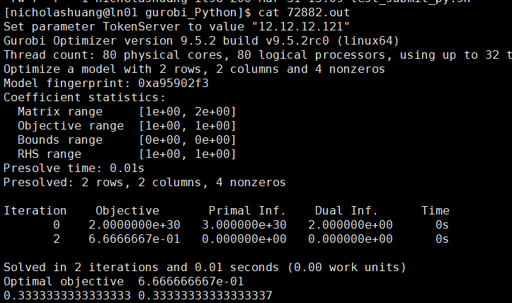

### 本文以CUHKSZ用户账号nicholashuang为例，请用户根据具体情况替换为自己的个人账号
### **1. SSH登陆CE集群的登陆节点10.27.130.12。**  
### **2. 登陆后创建存放执行脚本的文件目录。**  
   创建文件目录（本例文件目录为gurobi，各用户根据各自的情况创建自己的文件目录）  
   `$ mkdir -p /home/nicholashuang/gurobi `  
   `$ cd /home/nicholashuang/gurobi`  
### **3. 将执行文件传输到该目录下。**  
   要在CE集群上使用gurobi+Python3进行运算，需要有两个文件。  
   3.1 自己编写的py文件，本例中的py文件以test.py为例，内容如下，请用户根据实际情况更改py文件的命名和内容。
```python
from gurobipy import *

m = Model()
x1 = m.addVar(lb = 0.0)
x2 = m.addVar(lb = 0.0)
m.addConstr(x1 + 2*x2 <= 1)
m.addConstr(x2 + 2*x1 <= 1)
m.update()
m.setObjective(x1 + x2, GRB.MAXIMIZE)

m.optimize()
print(x1.x,x2.x)
```

3.2 提交任务的脚本，本例中提交任务的脚本以test_submit_py.sh为例，具体文件内容如下，用户根据实际情况更改该文件的命名和内容。  

```python
#!/bin/sh
#SBATCH -J test
#SBATCH -o %j.out
#SBATCH -e %j.err
#SBATCH --nodes=1
#SBATCH --ntasks=5
##SBATCH --exclusive

module load python/3.9.6 gurobi/952 metis/4.0 openblas/0.3.15

python3 test.py
```

请将这两个文件传输到上文新创建的目录，即/home/nicholashuang/gurobi中。  

### **4. 加载python 3环境，安装gurobi**  
加载python3  
`$ module load python/3.9.6`  
将python3.9.6加载到环境中后，可运行python3命令检查是否已经正常加载。  
`$ python3`  

输入exit()返回shell后，继续安装gurobi  
```python
>>> exit() 
$ pip3 install gurobipy==9.5.2
```
### **5. 提交任务**   
用 `sbatch` 提交作业  
`$ sbatch test_submit_py.sh`
在任务的执行过程中，可使用下列命令查看任务状态  
`$ squeue`  
`$ sacct`  
`$ scontrol show job xxxx` (xxxx为该job的id)  

### **6. 输出结果**  
按照本例程序里的设定，任务执行完毕后，会生成如图所示的两个文件  
  
确认任务是否有报错  
`$ cat xxx.err`  
确认任务输出结果  
`$ cat xxx.out`  
若本例正常结束，xxx.err 为空，xxx.out 的输出结果如下图所示：  
  
