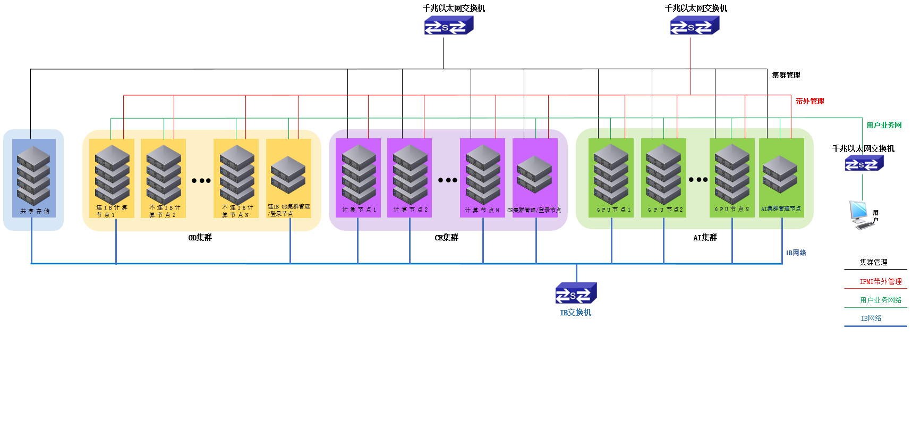
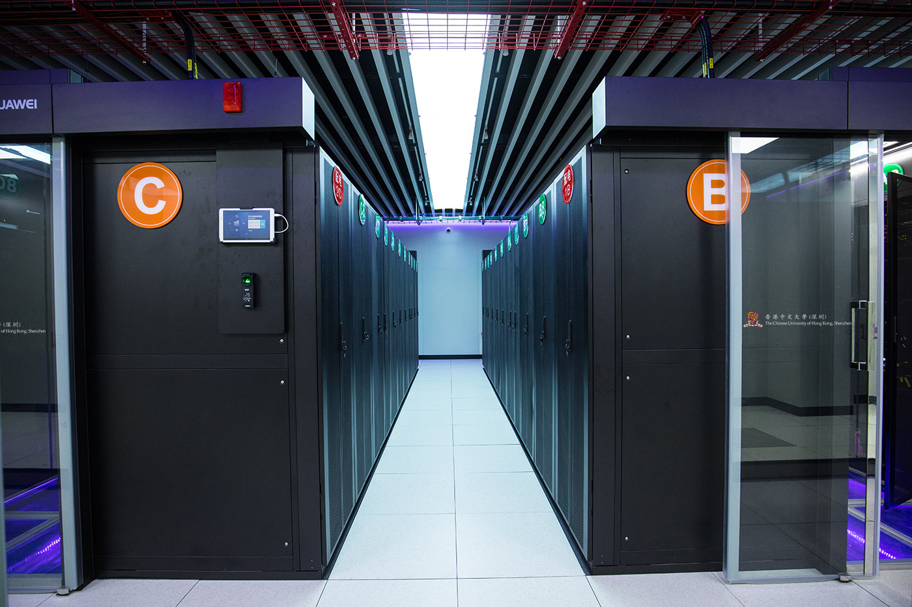

# 欢迎登录科研计算支持网站

For full documentation visit [mkdocs.org](https://www.mkdocs.org).

## Commands

* `mkdocs new [dir-name]` - Create a new project.
* `mkdocs serve` - Start the live-reloading docs server.
* `mkdocs build` - Build the documentation site.
* `mkdocs -h` - Print help message and exit.

# 平台介绍
&emsp;香港中文大学（深圳）高性能计算平台旨在为校内科研计算提供算力支撑服务，通过高性能计算集群管理平台、深度学习管理平台、高速大容量存储系统、高速IB计算网络等产品对大学现有零散的CPU服务器和GPU服务器进行统一管理，搭建一个校级高性能计算平台，也为日后大学建立领先级超算平台搭好整体框架。  

&emsp;高性能计算平台目前包含CE集群、AI集群和OD集群，为大学各类科研机构的科学计算提供一流的基础运算环境，为学校建设一个功能齐全、平台丰富、高效节能的高性能计算研究和服务中心。高性能计算平台的应用领域包括深度学习、新型材料、地球物理、生物医药健康、计算机辅助工程仿真等，涉及数学、统计学、物理学、化学、生物信息学、计算机科学等多个学科。

## 集群拓扑结构
  
## 机房展示  
  
  

## 联系我们  
邮箱：hpc@cuhk.edu.cn  

电话：0755-84273347  

地址：深圳市龙岗区龙翔大道2001号香港中文大学（深圳）知新429  