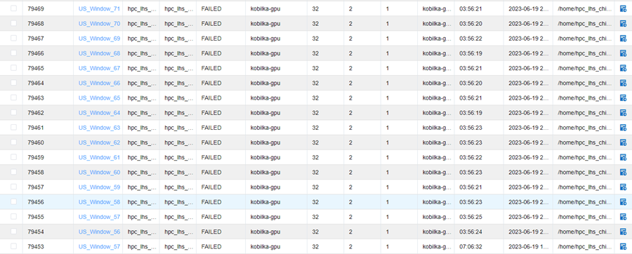
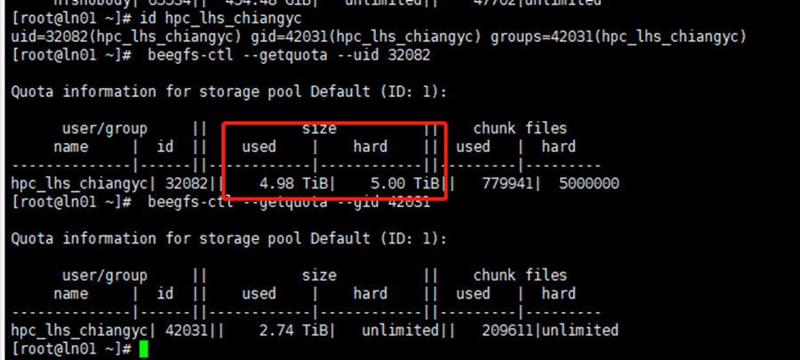

# 用户：
江瑛芝
# 日期
2023年6月19日
# 问题描述：
&ensp;&ensp;我們今天發現集群上有大批量的工作被結束，queuing system 也沒有紀錄原因，能不能請您幫忙檢查一下？謝謝您！路徑是/home/hpc_lhs_chiangyc/work/yunongxu/DNA/Model1/US

# 问题分析：

&ensp;&ensp;查看发现提交的作业都在凌晨00:39结束了，查看过往大量作业的运行情况，发现存在很多作业突然同时停止的情况。  
&ensp;&ensp;多个节点的多个作业在同一时间停止运行，一开始推测为用户使用交互式命令而不是sbatch命令提交作业，当用户电脑进入休眠导致作业运行中断。后和江老师沟通排除了这种情况。  
&emsp;然后猜想是用户磁盘配额用满导致数据无法写入，从而导致作业运行失败。
# 问题处理：
查看用户id  
`id hpc_lhs_chiangyc`  
根据用户id查询用户和用户组的配额  
`beegfs-ctl –getquota –uid=32082`  
`beegfs-ctl –getquota –gid=42031`  
  
&emsp;查询发现用户磁盘配额已用满，5TB配额几乎用完。因此，用户作业中断的原因是磁盘配额已用满，需要用户自行删除文件空出磁盘空间。  
&emsp;特殊情况下，由孙老师与用户协商磁盘扩容事宜。  